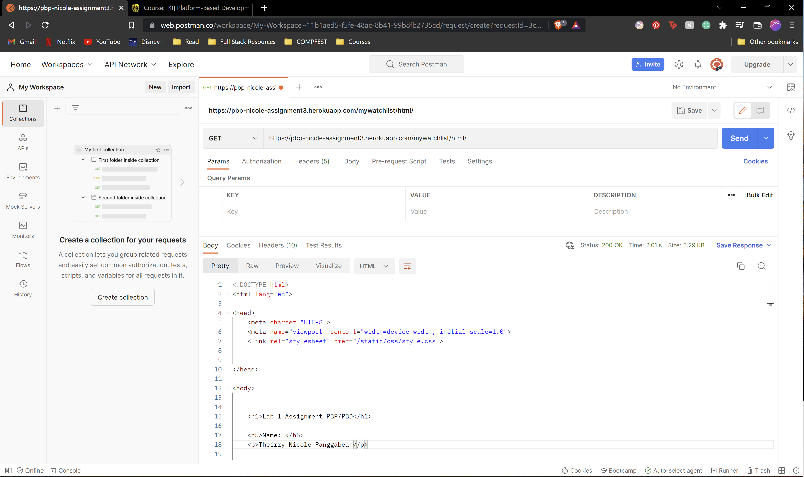

# Assignment 3

Heroku Link: https://pbp-nicole-assignment3.herokuapp.com/mywatchlist/

1. Explain the difference between JSON, XML, and HTML!

HyperText Markup Language (HTML) is a formatting language built for the web. It provides structure to content so that it'll be displayed in an organized manner. It is typically written in pairs of tags that denote how a certain piece of information will be displayed. For example, the 

 tags denote paragraph text.

eXtensible Markup Language (XML), similar to HTML, is a markup language, and is written in pairs of tags. However, it is considered to be dynamic, because its main priority is transporting the data, as opposed to displaying it (the way HTML does).

JavaScript Object Notation (JSON) utilizes the same code used for creating JavaScript objects, which make it easy to convert said JSON data to objects. Though the syntax comes from JavaScript, the format is text-only, meaning that both programs used to generate and read JSON data can be coded in any language.

2. Explain why we need the data delivery when implementing on a platform!

Data delivery is essentially the way a client and server communicate with one another. The client requests data, and the server responds with data. For example, if the client (browser) requests an HTML page, then the server will respond with an HTML file. If the client (browser) requests raw data, the server will respond with an XML or JSON file.

Data delivery allows for this interaction to happen. Without data delivery, the platform would be one-sided and would not allow for productive communication between parties.

3. Explain how you completed the tasks in this assignment!

First off, I started by creating a new app and initializing that app in the django project settings. I also added the URL path so the user can access it. Then, I built the model that contains the required attributes.

After doing so, I migrated the models and created a views function that would be able to convert it to HTML format. I also created a JSON file with the raw data as well as an HTML template.

Then, I modified the views function accordingly, and also added more functions to allow the data to be displayed in XML and JSON format. After that, I implemented URL routing so each of this formats can be accessed by the user.

Finally, I deployed the app to Heroku.

---
## Postman screenshots

Sources:
https://www.geeksforgeeks.org/html-vs-xml/

# Assignment 4

Heroku Link: https://pbp-nicole-assignment3.herokuapp.com/todolist

1.  What does  do in the <form> element? What happens if there is no such "code snippet" in the <form> element?
  
  The csrf_token template tag is a protection of sorts from Cross Site Request Forgeries (CSRF). It protects any information submitted through forms via POST. If there is no CSRF token, then there is no way to authenticate credentials, and anyone with malicious intent could take advantage of unsuspecting users (in other words, they could conduct forgery).

2. Can we create the <form> element manually (without using a generator like {{ form.as_table }})? Explain generally how to create <form> manually.
  
  We can. However, we'd need to create tags for each field. Typically, we'd need to specify its input type, the label or name, its value, and more. However, this isn't very effective for making forms with a larger number of fields, as it may get repetitive, or when a more complex field is needed.

3. Describe the data flow process from the submission made by the user through the HTML form, data storage in the database, until the appearance of the data that has been stored in the HTML template.
  
  When the user enters information into the form, the entries are used as arguments that are handled by views.py, and the data is stored in the models. Then, depending on the code, the server sends another HTML page as a result. In this case, once the data is entered and stored, it is displayed back to the user.
  

4. Explain how you implement the checklist above.
  
  First, I ran a virtual environment and created a new Django app. Then, I handled the URL routing by adding the required paths to urls.py (both in project_django and in todolist).
  
  Once I did so, I created a Task model with the required attributes. I used models.ForeignKey as the field for user, DateTimeField() for date, CharField() for title, and TextField() for description.
  
  Then, I edited views.py and urls.py to accommodate the registration, login, and logout forms. I also edited the HTML templates to ensure that these were functioning correctly.
  
  I then created a new function that would create a new Task object whenever the user inputted information in the create-task form. By doing so, I essentially saved the data and displayed it back to the user afterwards. I also created the form page in HTML to ensure it achieved what I wanted. Once done, I added the new URL to the path as well.
  
  Lastly, I deployed to Heroku and created tester accounts.
  
  
# Assignment 5

1. What is the difference between inline, internal, and external CSS? What are the advantages and disadvantages of each style?

  Inline CSS is directly applying the CSS code in our HTML. This means that a "style" argument is added to the HTML tags that need to be stylized. This means that the CSS is not applied to the entire document, but just to whatever tags it is added to.
  
  Internal CSS refers to the process of adding "" tags within the HTML document and writing the CSS directly there. Anything written between these tags would apply to the entire document accordingly.
  
  External CSS is the process of creating a completely separate CSS file and then importing it to the HTML file. To import, the "<link>" tag must be used in the HTML file.
  
  When all three are used to stylize a single HTML doc, inline CSS has the highest priority, which means there's more flexibility. It can override any internal or external CSS styles. This is most advantageous when wanting to stylize a minimal number of tags.
  
  Since internal CSS is applied to the whole document, it may be useful when wanting to customize shorter HTML docs. If the HTML doc itself is long and utilizes many div classes, it may cause the doc to be too crowded.
  
  External CSS is best used when the HTML doc is long and uses many tags. This means that the HTML file would only need a single <link> tag to import the external CSS stylization.

2. Describe the HTML5 tags that you know

`<!DOCTYPE>` a declaration of the document type
`<html>` the root of the html document
`<head>` place to store metadata of the document
`<meta>` defines the metadata of the document
`<title>` title of the document
`<body>` contents of the document
`<h1>-<h6>` create headings on the document of different sizes
`
` create paragraphs
`<a>` hyperlinks
`<button>` create buttons
`
` divide the HTML doc into sections
`<table>` create a table
`<tr>` defines rows
`<td>` defines cells
`<input>` defines a type of input control
`<form>` for defining forms in HTML
`<li>` list item
`<ol>` ordered list
`<ul>` unordered list
` ` line break

3. Describe the types of CSS selectors that you know

.class {} applies CSS formatting to all elements within that class
element {} applies CSS formatting to said element
element.class {} applies CSS formatting to said element but only within the specified class
:hover {} appies CSS formatting to the class/element when the user hovers over the item

4. Explain how you would implement the checklist above.

  First, I edited the base.html file to add bootstrap.

  Then, I created an external CSS file in styles/css and began stylizing the login page. To do so, I created a container for all the contents (to allow myself to place it at the center of the page), then I created another class to customize the login card. I modified the HTML table slightly to erase the columns. I made it so the login card only contained the title, username and password forms, the login button, and the create account hyperlink. This was to achieve a cleaner look. I modified the font style for headings, the background-color of the container and cards, the widths, as well as the transitions for the hover feature. When hovering over the card, I implemented a box-shadow. When hovering over the input forms, login button, and register link, I changed the colors accordingly. I did so by accessing the .class, element.class and :hover selectors.
  
  For the register form, I re-used the container for the login page, but I created a new register card. This was because I needed to display more information, and thus altered the width of the card to accommodate the information I needed to show. Due to the fact that the register page used the default UserCreationForm from django, I was not able to customize the contents. However, I did customize the create button, and re-used the login button CSS classes.
  
  Since the create-task form is very similar to the login form, I simply reused the login classes in the create-task HTML file. This meant that I didn't need to create any CSS customization.
  
  The process of creating the todolist was similar, but I modified the HTML file quite a bit. Since each task needed to have its own individual card, I removed the table tags. I created a container outside the for-loop, and then I created another class within the for-loop. This meant that I was able to customize each card individually, but also how they appeared within the container. I made it so multiple cards could appear in one row, but I enabled flex-wrap to allow it to wrap around to another row if more space is needed.
